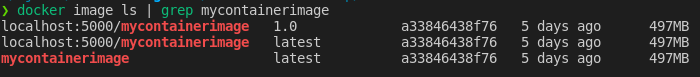

# Container Basics - Dockerfiles

### This lab will cover the following topics:

* Dockerfiles
* Docker/Container Registries

 
 

---
---

## Lab 1 - Dockerfiles

Docker can build images automatically by reading the instructions from a Dockerfile. A Dockerfile is a text document that contains all the commands a user could call on the command line to assemble an image.

 

---

 

### Useful Links

* [Dockerfile Best Practices](https://docs.docker.com/engine/reference/builder/)
* [Dockerfile Full Documentation](https://docs.docker.com/engine/reference/builder/)

 

---

 

### Change the Working Directory

Change to the Dockerfile directory: 
`cd /ab/labs/containers/dockerfiles` {{ execute }}

 

---

 

### Copy the Dockerfile Example

The `Dockerfile.example` will be used as a template. Copy `Dockerfile.example` to `Dockerfile` in the same directory: 
`cp Dockerfile.example Dockerfile` {{ execute }}

 

---

 

### Modify the Dockerfile

As rockylinux:9 is the latest version, change the `FROM` line in the Dockerfile to `FROM rockylinux:9`.

Open the Dockerfile in VSCode: 
`/ab/labs/containers/dockerfiles/Dockerfile` {{ open }}

> **NOTE:** Rocky Linux is a RHEL based linux distribution, similar to AlmaLinux and CentOS. It is a community driven project that was created after the announced discontinuation of CentOS 8.

 

---

 

### Open the Index File

Open the index file in VSCode: 
`/ab/labs/containers/dockerfiles/index.html` {{ open }}

 

---

 

### Modify the Index File

Change the text to **"Welcome to the AlphaBravo Container Bootcamp"** in the default `index.html` file.

> **NOTE:** Be sure to save the changes in VS Code before continuing.

 

---

 

### Build the Container Image

Build the container image from the Dockerfile: 
`docker build -t mycontainerimage:latest .` {{ execute }}

> **NOTE:** As the container image is being built, the output of each layer in the Dockerfile will be shown. This is useful for troubleshooting and understanding what is happening during the build process.

 

---

 

### Run the Container Image

Once the build is complete, run the new container image: 
`docker run -itd --name mycontainer -p 8070:80 mycontainerimage:latest` {{ execute }}

 

---

 

### Validate the Container Changes

Confirm the release is rockylinux:9 by executing the `cat /etc/os-release` command inside the running container: 
`docker exec -it mycontainer cat /etc/os-release` {{ execute }}

Visit http://8070.LABSERVERNAME to see the custom index file message.

 

---

 

### Cleanup the Container

Finally, clean up the container: 
`docker rm -f mycontainer` {{ execute }}

 
 

---
---

## Lab 2 - Container Registries

A container registry is a stateless, highly scalable server side application that stores and distributes container images.

 

---

 

### Useful Links

* [Docker Hub Quickstart](https://docs.docker.com/docker-hub/)
* [Docker Tag Documentation](https://docs.docker.com/engine/reference/commandline/tag/)
* [Docker Push Documentation](https://docs.docker.com/engine/reference/commandline/push/)

 

---

 

### Docker Hub

Docker Hub is the most popular of the online image registries. Create an account at https://hub.docker.com and try pushing images to one or more registries.

> **SECURITY NOTE:** Do not push images with private or important information to Docker Hub. Docker Hub is a public registry and anyone can pull your images. If a need exists to push images with private information, use a private registry instead of a public registry.

 

---

 

### Local Registry

For this course, the Lab environment has a registry running on the local server at http://localhost:5000. There is no web interface, but it works for the purposes of this lab environment.

The following sections will re-tag the image created in Lab 1 using 2 distinct tags to allow images to be pushed to the local registry. The original image will not be modified or replicated, but will have 2 tags pointing to the same image hash.

 

---

 

### Tag the Image with a Version

First, tag an image with `localhost:5000/mycontainerimage:1.0`: 
`docker tag mycontainerimage:latest localhost:5000/mycontainerimage:1.0` {{ execute }}

> **NOTE:** The `localhost:5000` is the hostname and port of the local registry, and must be included in the tag in order to push to the local registry.

> **NOTE:** When tagging an image version, it is recommended to follow SemVer (Semantic Versioning) guidelines. See https://semver.org/ for more information.

 

---

 

### Tag the Image with Latest

Tag the same image with `localhost:5000/mycontainerimage:latest`: 
`docker tag mycontainerimage:latest localhost:5000/mycontainerimage:latest` {{ execute }}

> **NOTE:** The `latest` tag is a special tag that is used by default when no tag is specified. It is recommended to use a version tag instead of `latest` for production images.

 

---

 

### Verify the Image Tags

Though the image tags are different, the image IDs are the same. It is possible to verify this by running the following command: 
`docker image ls | grep mycontainerimage` {{ execute }}

> **NOTE:** When running the command, the IDs presented in the command line will be different from the ones shown in the example above. However, they should all match as shown in the screenshot.

 

---

 

### Push the Images to the Local Registry

Push the `1.0` image to the local registry: 
`docker push localhost:5000/mycontainerimage:1.0` {{ execute }}

Push the `latest` image to the local registry: 
`docker push localhost:5000/mycontainerimage:latest` {{ execute }}

> **Note:**  The first upload may take some time to complete, but the second is very quick. This is because the registry recognized these were the same image and just needed to add an additional tag to reference one another.

 

---

 

### Verify the Images in the Local Registry

It is possible to verify the images are in the local registry by querying the registry with the following command to list the images in the registry catalog: 
`curl -s -X GET http://localhost:5000/v2/_catalog | jq` {{ execute }}

> **NOTE:** The registry API is a REST API and can be queried with any HTTP client. In this case, `curl` is used to query the API HTTP endpoint.

> **NOTE:** The `jq` command is a JSON processor. It is used to format the output of the `curl` command to make it easier to read.

 

---

 

### Verify the Image Tags in the Local Registry

It's also possible to query the registry for the tags associated with the image: 
`curl -s -X GET http://localhost:5000/v2/mycontainerimage/tags/list | jq` {{ execute }}

 

---

 

### Delete the Images from the Local System

Delete the image from the local system: 
`docker image rm localhost:5000/mycontainerimage:1.0 localhost:5000/mycontainerimage:latest` {{ execute }}

> **NOTE:** To show how Docker will automatically pull images from a registry, delete the local version of these images and run a container with the new tag. The image will automatically pull and run.

 

---

 

### Run the Container from the Local Registry

The following command will create a container, using the image from the local registry: 
`docker run -itd --name mycontainer -p 8070:80 localhost:5000/mycontainerimage:latest` {{ execute }}

> **NOTE:** As the images were no longer stored on the local system, Docker automatically pulled the images from the registry.

 

---

 

### Cleanup the Container

Clean up the container and prune the system: 
`docker rm -f mycontainer && docker image prune -a -f` {{ execute }}

> **NOTE:** The image prune command will remove all images that are not currently in use by a container. This is useful for cleaning up the local system. The `-a` flag will remove all images, including dangling images. The `-f` flag will force the command to run without prompting for confirmation.

 
 

---
---

**Congrats! You have completed the Dockerfiles lab.**
